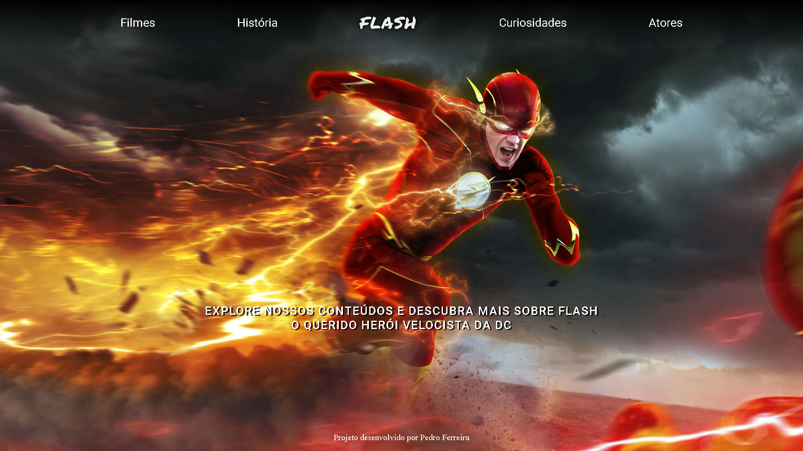
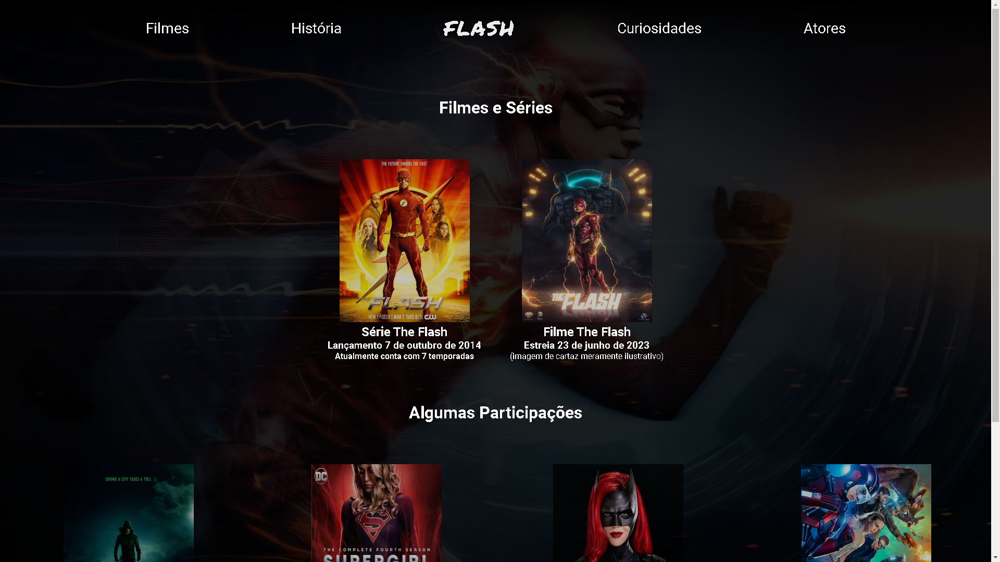
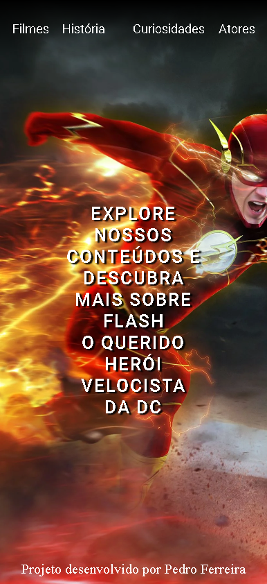
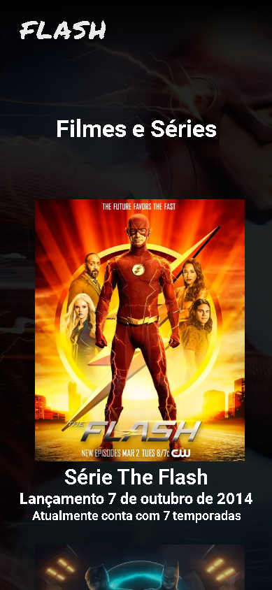

<h1 align="center">Projeto Flash</h1>

## Descrição do projeto

Esse é um projeto criado por mim para treinar minhas habilidades com HTML, CSS e Responsividade. Além de ser um projeto para meu portfólio!

### Features

- [x] Html 5 páginas
- [x] Css 5 páginas
- [x] Responsividade 5 páginas

### Skills

<h1 align="center"> 
	 🚀 Projeto concluído com sucesso... 🚀
</h1>

### 🌐 Deploy
<a href="https://pedroferreirasousa.github.io/projetoflash/index.html">https://pedroferreirasousa.github.io/projetoflash/index.html</a>

<h1 align="center" style="font-weight: 600";>Tela Inicial</h1>

<h1 align="center" style="font-weight: 600";>Seção Filmes</h1>
  

  
<h1 style="font-weight: 600";>Tela inicial Versão 📱 Mobile</h1>

<h1 style="font-weight: 600";>Seção filmes  📱 Mobile</h1>

